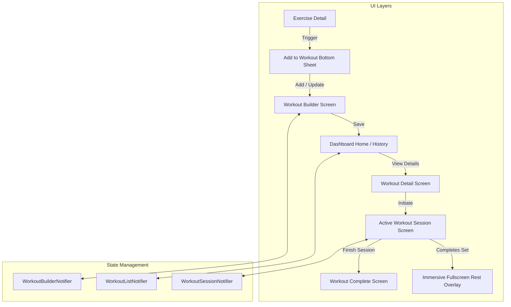

# System Design: KRATOS Cinematic Workout System
**Date:** 2026-05-20  
**Status:** PROPOSED (Awaiting User Review)

---

## 1. Executive Summary & Goals
The **KRATOS Workout System** is designed as a world-class, immersive, and tactical fitness planning and tracking module. Unlike generic CRUD fitness apps, it operates on a **high-agency, production-grade flow** characterized by fluid glassmorphism, responsive ambient glow backdrops, interactive haptic-aligned controls, and flawless asynchronous state transitions using **Riverpod** and **Cloud Firestore** (with built-in offline caching).

### Key Experience Pillars
- **Ambient Blurs & Neon Glows:** Active media screens reflect blurred versions of dynamic images/GIFs with `#FF3B3B` overlay gradients.
- **Tactile Inputs:** Segmented sliders, circular wheels, and stepper pickers replace standard textbox entry.
- **Tactical Session Tracking:** Single-focus workout screens with full-screen, high-impact Rest Countdown overlays.
- **Stat Pride:** Bold post-workout completion screens displaying visual stats like personal records, total volume, and calorie burning.

---

## 2. Core Data Models (`lib/features/workout/domain/models/`)

To support fine-grained set-by-set progress tracking (completed vs active vs outstanding), we expand the database structure into three decoupled models:

### `WorkoutSet`
Tracks individual set progression during an active workout session.
```dart
class WorkoutSet {
  final String id;
  final int setNumber;
  final int reps;
  final double weight; // KG or LBS
  final bool isCompleted;

  WorkoutSet({
    required this.id,
    required this.setNumber,
    required this.reps,
    required this.weight,
    this.isCompleted = false,
  });

  WorkoutSet copyWith({
    int? reps,
    double? weight,
    bool? isCompleted,
  }) {
    return WorkoutSet(
      id: id,
      setNumber: setNumber,
      reps: reps ?? this.reps,
      weight: weight ?? this.weight,
      isCompleted: isCompleted ?? this.isCompleted,
    );
  }

  Map<String, dynamic> toJson() => {
        'id': id,
        'setNumber': setNumber,
        'reps': reps,
        'weight': weight,
        'isCompleted': isCompleted,
      };

  factory WorkoutSet.fromJson(Map<String, dynamic> json) => WorkoutSet(
        id: json['id'] as String,
        setNumber: json['setNumber'] as int,
        reps: json['reps'] as int,
        weight: (json['weight'] as num).toDouble(),
        isCompleted: json['isCompleted'] as bool? ?? false,
      );
}
```

### `WorkoutExercise`
Couples a specific exercise from the Exercise Library with its target set configurations.
```dart
class WorkoutExercise {
  final String exerciseId;
  final String name;
  final String category;
  final String image;
  final String gifUrl;
  final int restSeconds;
  final List<WorkoutSet> sets;
  final String? notes;

  WorkoutExercise({
    required this.exerciseId,
    required this.name,
    required this.category,
    required this.image,
    required this.gifUrl,
    required this.restSeconds,
    required this.sets,
    this.notes,
  });

  WorkoutExercise copyWith({
    int? restSeconds,
    List<WorkoutSet>? sets,
    String? notes,
  }) {
    return WorkoutExercise(
      exerciseId: exerciseId,
      name: name,
      category: category,
      image: image,
      gifUrl: gifUrl,
      restSeconds: restSeconds ?? this.restSeconds,
      sets: sets ?? this.sets,
      notes: notes ?? this.notes,
    );
  }

  Map<String, dynamic> toJson() => {
        'exerciseId': exerciseId,
        'name': name,
        'category': category,
        'image': image,
        'gifUrl': gifUrl,
        'restSeconds': restSeconds,
        'sets': sets.map((s) => s.toJson()).toList(),
        'notes': notes,
      };

  factory WorkoutExercise.fromJson(Map<String, dynamic> json) => WorkoutExercise(
        exerciseId: json['exerciseId'] as String,
        name: json['name'] as String,
        category: json['category'] as String,
        image: json['image'] as String,
        gifUrl: json['gifUrl'] as String,
        restSeconds: json['restSeconds'] as int? ?? 90,
        sets: (json['sets'] as List<dynamic>?)
                ?.map((e) => WorkoutSet.fromJson(e as Map<String, dynamic>))
                .toList() ??
            [],
        notes: json['notes'] as String?,
      );
}
```

### `Workout`
The static template/routine created by the builder.
```dart
class Workout {
  final String id;
  final String userId;
  final String name;
  final String split; // Push, Pull, Legs, Upper, Lower, Full Body
  final DateTime createdAt;
  final List<WorkoutExercise> exercises;

  Workout({
    required this.id,
    required this.userId,
    required this.name,
    required this.split,
    required this.createdAt,
    required this.exercises,
  });

  Map<String, dynamic> toJson() => {
        'id': id,
        'userId': userId,
        'name': name,
        'split': split,
        'createdAt': createdAt.toIso8601String(),
        'exercises': exercises.map((e) => e.toJson()).toList(),
      };

  factory Workout.fromJson(Map<String, dynamic> json) => Workout(
        id: json['id'] as String,
        userId: json['userId'] as String,
        name: json['name'] as String,
        split: json['split'] as String,
        createdAt: DateTime.parse(json['createdAt'] as String),
        exercises: (json['exercises'] as List<dynamic>?)
                ?.map((e) => WorkoutExercise.fromJson(e as Map<String, dynamic>))
                .toList() ??
            [],
      );
}
```

### `WorkoutSession`
Represents a recorded history item of a fully tracked workout session.
```dart
class WorkoutSession {
  final String id;
  final String workoutId;
  final String workoutName;
  final DateTime startedAt;
  final DateTime completedAt;
  final int totalDurationSeconds;
  final double totalVolumeKg;
  final int caloriesBurned;
  final List<WorkoutExercise> completedExercises;

  WorkoutSession({
    required this.id,
    required this.workoutId,
    required this.workoutName,
    required this.startedAt,
    required this.completedAt,
    required this.totalDurationSeconds,
    required this.totalVolumeKg,
    required this.caloriesBurned,
    required this.completedExercises,
  });

  Map<String, dynamic> toJson() => {
        'id': id,
        'workoutId': workoutId,
        'workoutName': workoutName,
        'startedAt': startedAt.toIso8601String(),
        'completedAt': completedAt.toIso8601String(),
        'totalDurationSeconds': totalDurationSeconds,
        'totalVolumeKg': totalVolumeKg,
        'caloriesBurned': caloriesBurned,
        'completedExercises': completedExercises.map((e) => e.toJson()).toList(),
      };

  factory WorkoutSession.fromJson(Map<String, dynamic> json) => WorkoutSession(
        id: json['id'] as String,
        workoutId: json['workoutId'] as String,
        workoutName: json['workoutName'] as String,
        startedAt: DateTime.parse(json['startedAt'] as String),
        completedAt: DateTime.parse(json['completedAt'] as String),
        totalDurationSeconds: json['totalDurationSeconds'] as int,
        totalVolumeKg: (json['totalVolumeKg'] as num).toDouble(),
        caloriesBurned: json['caloriesBurned'] as int,
        completedExercises: (json['completedExercises'] as List<dynamic>?)
                ?.map((e) => WorkoutExercise.fromJson(e as Map<String, dynamic>))
                .toList() ??
            [],
      );
}
```

---

## 3. Architecture & State Management (Riverpod)



### Providers Defined:
1. **`workoutListProvider` (AsyncNotifier<List<Workout>>)**
   - Responsible for fetching, adding, reordering, and deleting workouts in Cloud Firestore.
   - Leverages offline caching so routines load instantly even when offline.
2. **`workoutBuilderProvider` (Notifier<Workout?>)**
   - Manages temporary in-progress states while composing or editing a workout.
   - Allows users to name splits, append new exercises, and reorder elements before saving.
3. **`workoutSessionProvider` (Notifier<WorkoutSessionState>)**
   - Keeps track of the active workout timer, exercise focus index, current sets, and completion status.
   - Handles triggering the active rest timer overlays and aggregating volumes for completion screens.

---

## 4. UI & Flow Integration

### Screen 1: Add-To-Workout Bottom Sheet
*Triggered from `ExerciseDetailScreen` bottom FAB.*
- **Header:** Glass-card top notch, floating exercise thumbnail, muscle group name, and small neon difficulty badge.
- **Steppers & Segments:**
  - *Sets Stepper:* Interactive floating numeric picker with tactile `+` / `-` buttons.
  - *Reps Segment selector:* Sleek sliding selector for ranges (e.g., `6-8`, `8-10`, `10-12`, `12-15`, `15+`).
  - *Weight circular dial:* Custom numeric slider or drag-arc for target weight (integrated KG/LBS glass badge toggle).
  - *Rest Pills:* Horizontal scrolling pill selector: `30s`, `60s`, `90s`, `120s`, and `Custom`.
- **Primary Actions:** Two primary buttons (`Add to Existing` and `Create New Workout`) built with heavy red glow decorations.

### Screen 2: Workout Builder Screen
- **Header:** Text field with glowing neon indicator to input/edit the Custom routine name, along with horizontal split chips (`Push`, `Pull`, `Legs`, `Upper`, `Lower`, `Full Body`).
- **Interactive List:** Reorderable list view utilizing `ReorderableListView.builder` for sorting exercises. Each exercise card is customized with handles (`Icons.reorder_rounded`), set details, and swipe-to-delete behaviors.

### Screen 3: Workout Detail Screen
- **Visuals:** Matte-black background featuring muscle stresses (integrated highlight metrics).
- **Metadata Cards:** Multi-column layout tracking estimated time (duration index calculated dynamically), total set count, and estimated target calories.
- **CTAs:** Hero-animated "Start Workout" button with floating neon red shadows.

### Screen 4 & 5: Workout Session Screen & Rest Timer
- **Live Media Viewer:** Floating Exercise GIF container positioned below top bar indicators. Backed by a high-blur canvas reflecting active color streams.
- **Session Progress:** Top linear visual steps indicating progress (e.g., set completion ratios).
- **Rest Timer Overlay:** Full-screen overlay triggered automatically upon set completion:
  - Ambient circular progress indicator matching the counting sequence.
  - Controls to Pause, Skip, or Extend (`+15s`) countdowns.
  - Interactive background particles emitting high-tech pulse grids.

### Screen 6: Celebration (Completion) Screen
- **Visuals:** Large central neon completion checkmark surrounded by animated progress statistics.
- **Highlights:** Dynamic layout displaying total lifted volume, elapsed minutes, completed exercises, and PRs (Personal Records) calculated from Firestore history.
- **Action Group:** Interactive buttons to save stats, export/share cards, or route back home.

---

## 5. Routing & Integration (`lib/core/routing/app_router.dart`)

We integrate the workout flows directly under the authorized routing shell:

```dart
// Paths:
// - /workout/create           -> WorkoutBuilderScreen
// - /workout/detail/:id       -> WorkoutDetailScreen
// - /workout/session/:id      -> WorkoutSessionScreen
// - /workout/complete         -> WorkoutCompleteScreen
```

---

## 6. Brainstorming Decision Points (Awaiting Approval)

To proceed with maximum precision, **which storage & sync approach would you prefer?**

* **Option A: Pure Cloud Firestore with Offline-First Cache (Recommended)**
  - Automatically saves routines to the user's Firestore workspace under `/users/{uid}/workouts/` and sessions under `/users/{uid}/sessions/`.
  - Firebase handles all offline queries and updates instantly out of the box using local SQLite-like caching, which syncs seamlessly when connected.

* **Option B: Pure Local Persistence First (Shared Preferences/Hive JSON)**
  - Keep everything local inside the mobile sandbox. Fast and independent of Firestore syncing, but doesn't back up stats securely to user accounts across devices.

* **Option C: Hybrid Custom Sync**
  - Manually store to local JSON files first, then execute a separate background sync queue to push to Firestore. (Adds slightly more boilerplate but gives absolute control).

* **Decision 2: GIF Assets**
  - Should the Workout Session screen load the custom local assets defined in `assets/exercises/` or do we have remote video stream capabilities ready? (We will leverage `localGifPath` / `localImagePath` fallback as currently implemented in the Exercise model).

---

### Next Action Step
Once you review this design structure and select your preferred storage system (Option A, B, or C), we will generate the comprehensive **Implementation Plan** and begin crafting this futuristic module!
